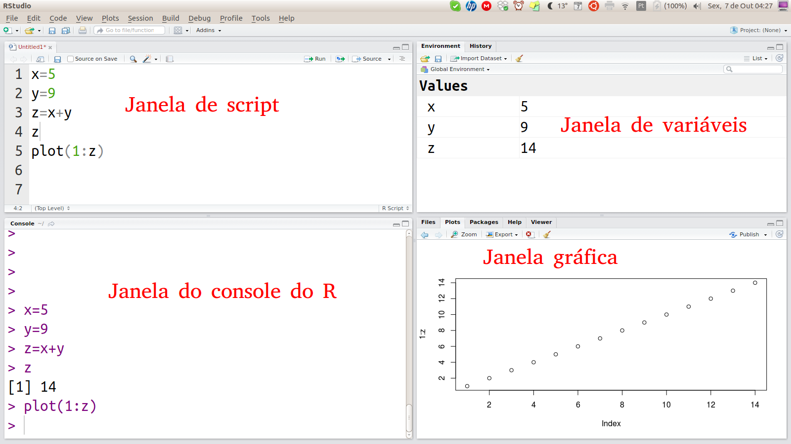

# (PART) Desvendando o R {-}

# Primeiros passos {#primeiropasso}

## Conhecendo o Rstudio

o Rstudio é dividido em quatro janelas: 

A janela superior esquerda é um simples editor de texto que reconhece o código em R. Esta é a janela de scipts do Rstudio. Cada arquivo aberto pelo Rstudio é colocado numa nova aba dessa janela. 

A janela inferior esquerda mostra o próprio R em ação. Se trata do console do R, que mostra o andamento do processamento do R e suas mensagens.

Os comandos da janela de scripts pode ser passados para o console do R usando **Ctr+Enter** ou pressionando o botão *Run*.

**Atalhos do teclado interessantes:**

| Atalho do techado | Ação                                               |
| ----------------- | -------------------------------------------------- |
|Ctrl+Enter         | Enviar o código da linha atual para o console do R |
|Ctrl+O             | Abrir um arquivo                                   |
|Ctrl+PgUp          | Aba de scritp anterior                             |
|Ctrl+PgDw          | Aba de scritp seguinte                             |
|Ctrl+S             | Salva o documento atual                            |
